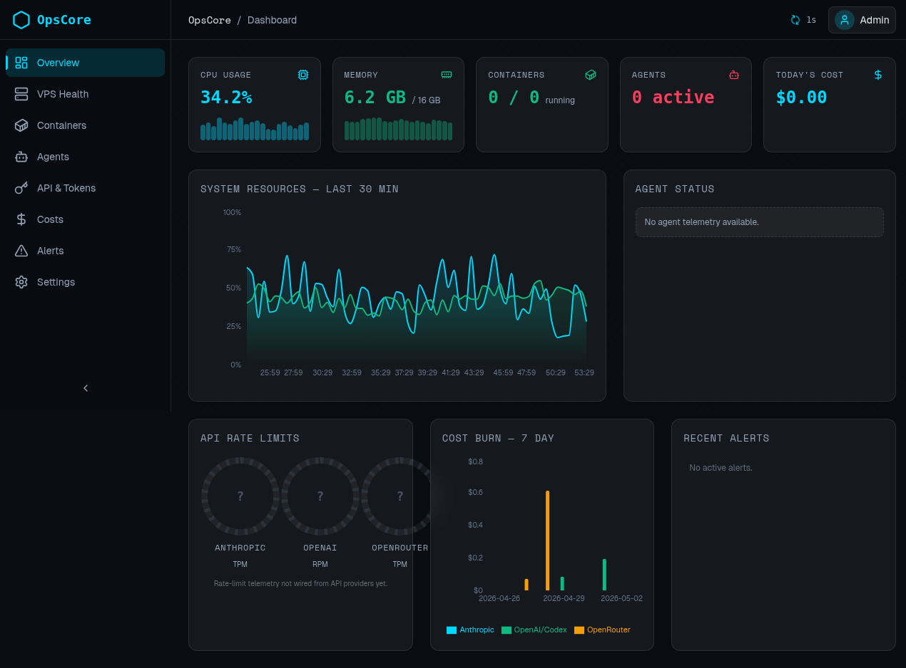
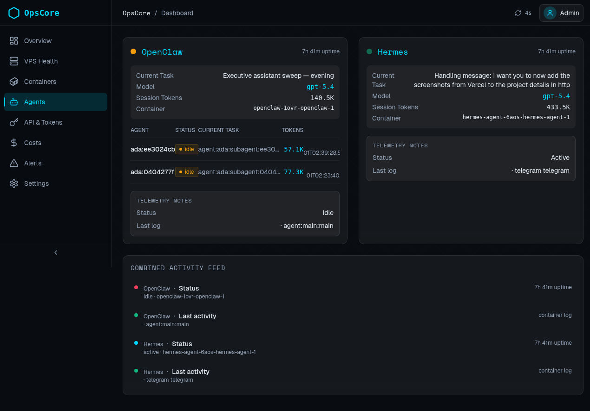
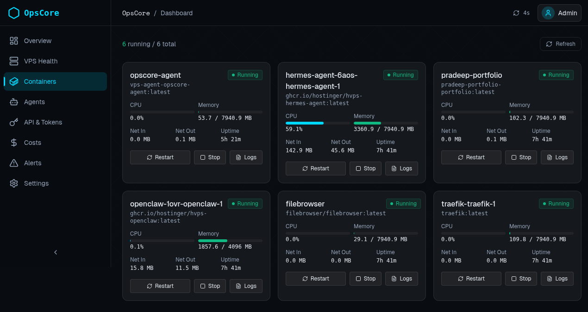
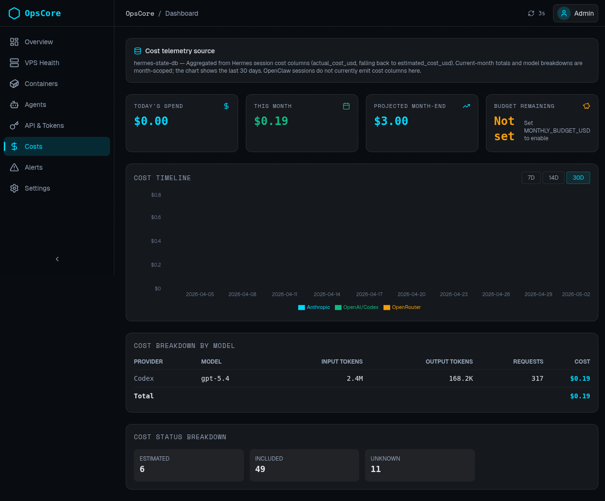

# OpsCore Dashboard

A telemetry dashboard for monitoring my VPS, Docker containers, and AI agent workloads from one place.

**Live deployment:** https://opscore-dashboard-app.vercel.app  
**Repo:** https://github.com/realgradientdescent/opscore-dashboard

## Project details

OpsCore started as a way to stop managing my infra and agent stack blindly.
I wanted one dashboard that could answer practical questions fast:

- Is the VPS healthy?
- Which containers are actually running?
- What are Hermes and OpenClaw doing right now?
- How much model usage is accumulating?
- Are there alerts I should care about right now?

The app is built with **Next.js 16**, **React 19**, **Tailwind CSS 4**, **SWR**, and **Recharts**.
It pulls telemetry through a small `vps-agent` service that reads host/container state and exposes dashboard-friendly APIs.

## What this project demonstrates

- **Operational product thinking** — turning raw infra state into a readable operator dashboard
- **Full-stack telemetry wiring** — frontend + API routes + VPS-side agent service
- **Agent observability** — surfacing Hermes and OpenClaw status, task context, and session usage
- **Container awareness** — showing the real services supporting my workflow, including this portfolio site
- **Cost visibility** — tracking provider/model usage and projected spend
- **Deployment discipline** — live Vercel frontend backed by a VPS telemetry service

## Evidence from the live Vercel deployment

These screenshots were captured from the deployed app on Vercel and committed into this repo as portfolio evidence.

### Overview



### Agents



### Containers



### Costs



## What the screenshots show

- **Overview** — high-level CPU, memory, container, agent, cost, and alert visibility
- **Agents** — live Hermes and OpenClaw telemetry, including active task context and session tokens
- **Containers** — running infra services like `opscore-agent`, `hermes-agent`, `openclaw`, `pradeep-portfolio`, and `traefik`
- **Costs** — provider/model usage totals and simple spend tracking for the current month

## Architecture

### Frontend
- Next.js App Router dashboard
- Dark-theme operator UI
- SWR polling for fresh telemetry
- Recharts for time-series and cost visualizations

### Telemetry layer
- Next.js API routes under `app/api/*`
- VPS-side `vps-agent/` service for health, containers, agents, costs, alerts, and token data
- Header-based auth between the dashboard and VPS agent

### Deployment
- **Frontend:** Vercel
- **Telemetry backend:** Ubuntu VPS (`srv1573728.hstgr.cloud`) via Docker
- **Observed services:** Hermes, OpenClaw, portfolio site, Traefik, and supporting containers

## Repo structure

- `app/` — dashboard routes and API endpoints
- `components/` — cards, charts, and layout building blocks
- `lib/` — hooks, API types, utilities, and mock/transform helpers
- `vps-agent/` — VPS telemetry service used by the dashboard
- `evidence/screenshots/vercel/` — screenshots captured from the live deployment
- `DEPLOY.md` — deployment notes for the dashboard and VPS agent
- `docs/project-details.md` — expanded write-up for portfolio/case-study reuse

## Local development

```bash
npm install
npm run dev
```

Then open `http://localhost:3000`.

## Environment variables

Typical dashboard env vars:

```bash
VPS_AGENT_URL=http://72.62.96.98:8765
VPS_AGENT_API_KEY=...
NEXTAUTH_URL=https://opscore-dashboard-app.vercel.app
NEXTAUTH_SECRET=...
GOOGLE_CLIENT_ID=...
GOOGLE_CLIENT_SECRET=...
```

See [`DEPLOY.md`](DEPLOY.md) for the fuller deployment flow.

## Why this matters in my portfolio

This is not just a pretty admin template.
It is a working internal tool for making my AI/infra stack observable:

- I can see what my agents are doing
- I can verify which containers are healthy
- I can inspect cost usage without digging through multiple providers
- I can connect agent operations to the real infra they depend on

That is the kind of practical systems work I want my portfolio to show.
